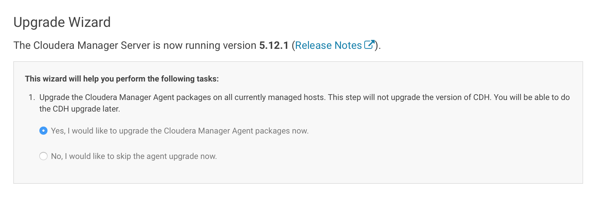
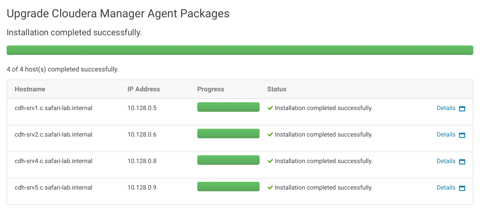

# Upgrade Cloudera Manager

## Upgrade to the latest C5.9 release

Back up the following directories on the Cloudera Manager server host:
/etc/cloudera-scm-server
/etc/cloudera-scm-agent

```
$ sudo mkdir /etc/cloudera-scm-server-backup/
$ sudo cp -pR /etc/cloudera-scm-server/* /etc/cloudera-scm-server-backup/
```

```
$ sudo mkdir /etc/cloudera-scm-agent-backup/
$ sudo cp -pR /etc/cloudera-scm-agent/* /etc/cloudera-scm-agent-backup/
```

To upgrade using the Cloudera repository:

Back up the current Cloudera Manager repo file, located in /etc/yum.repos.d/
```
$ sudo mkdir /etc/yum.repos.d-backup/
$ sudo cp -pR /etc/yum.repos.d/* /etc/yum.repos.d-backup/
```

Download the Cloudera .repo file for your distribution by starting at https://archive.cloudera.com/cm5/ and navigating to the directory that matches your operating system.
For Red Hat or CentOS 6, go to the appropriate release directory, for example, https://archive.cloudera.com/cm5/redhat/6/x86_64/cm/

```
$ wget https://archive.cloudera.com/cm5/redhat/6/x86_64/cm/cloudera-manager.repo
```

Copy the cloudera-manager.repo file to the configuration location for the package management software for your system:
RHEL
Copy cloudera-manager.repo to /etc/yum.repos.d/

```
$ sudo cp cloudera-manager.repo /etc/yum.repos.d/cloudera-manager.repo
```

Run the following command to clean the cache directories and upgrade the software:
RHEL
```
sudo yum clean all
sudo yum upgrade cloudera-manager-server cloudera-manager-daemons cloudera-manager-agent
```

On the Cloudera Manager Server host, verify that you now have the following packages, corresponding to the version of Cloudera Manager you installed, by running the following command:
RPM-based distributions
```
$ rpm -qa 'cloudera-manager-*'
cloudera-manager-server-5.12.0-0.cm5120.p0.120.el6.x86_64
cloudera-manager-agent-5.12.0-0.cm5120.p0.120.el6.x86_64
cloudera-manager-daemons-5.12.0-0.cm5120.p0.120.el6.x86_64
```
Start Cloudera Manager Server. On the Cloudera Manager Server host (the host on which you installed the cloudera-manager-server package), do the following:
```
sudo service cloudera-scm-server start
```

Log in to the Cloudera Manager Admin Console. It can take several minutes for Cloudera Manager Server to start, and the console is unavailable until the server startup is complete.
The Upgrade Wizard displays.




## Use the API on the command line to:
* Report the latest available version of the API
* Report the CM version
* List all CM users
* Report the database server in use by CM
