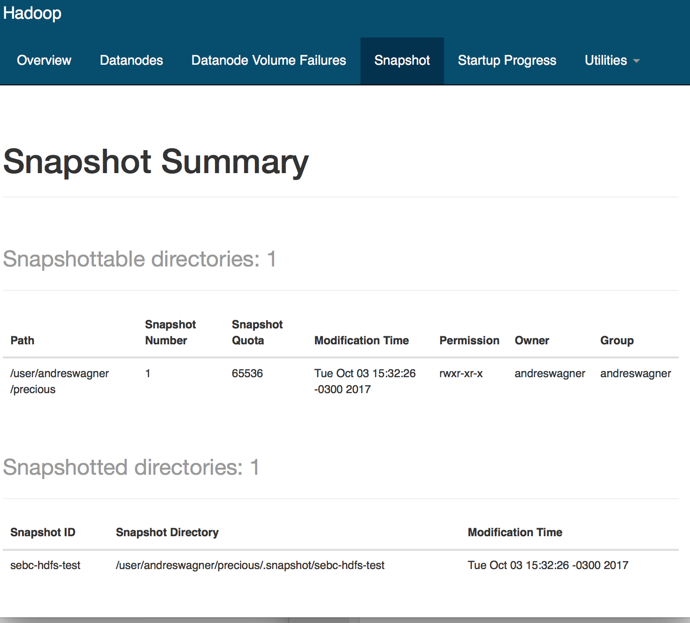

List the commands and output for each step below in storage/labs/2_snapshot_test.md.

Create a precious directory in HDFS; 
```
$ hdfs dfs -mkdir /user/andreswagner/precious
```

copy the ZIP course file into it.
```
$ hdfs dfs -put SEBC-master-students.zip /user/andreswagner/precious/
$ hdfs dfs -ls /user/andreswagner/precious/
Found 1 items
-rw-r--r--   3 andreswagner andreswagner     474831 2017-10-03 18:01 /user/andreswagner/precious/SEBC-master-students.zip
```

Enable snapshots for precious
```
$ sudo su - hdfs
[hdfs@cdh-srv5 ~]$ hdfs dfsadmin -allowSnapshot /user/andreswagner/precious/
Allowing snaphot on /user/andreswagner/precious/ succeeded
```

Create a snapshot called sebc-hdfs-test
```
$ hdfs dfs -createSnapshot /user/andreswagner/precious/ sebc-hdfs-test
Created snapshot /user/andreswagner/precious/.snapshot/sebc-hdfs-test
```

Delete the directory
```
$ hdfs dfs -ls /user/andreswagner/precious/.snapshot/
Found 1 items
drwxr-xr-x   - andreswagner andreswagner          0 2017-10-03 18:09 /user/andreswagner/precious/.snapshot/sebc-hdfs-test
```

Copy Snapshot
```
$ hdfs dfs -cp /user/andreswagner/precious/.snapshot/sebc-hdfs-test /user/andreswagner/sebc-hdfs-test.snapshot
```

Delete Snapshot
```
$ hdfs dfs -deleteSnapshot /user/andreswagner/precious/ sebc-hdfs-test
```

Disable Snapshot
```
$ hdfs dfsadmin -disallowSnapshot  /user/andreswagner/precious/
Disallowing snaphot on /user/andreswagner/precious/ succeeded
```

Delete the ZIP file
```
$ hdfs dfs -rm /user/andreswagner/precious/SEBC-master-students.zip
```

Restore the deleted file
```
$ hdfs dfs -ls  /user/andreswagner/sebc-hdfs-test.snapshot
Found 1 items
-rw-r--r--   3 hdfs andreswagner     474831 2017-10-03 18:17 /user/andreswagner/sebc-hdfs-test.snapshot/SEBC-master-students.zip
```

Recovering from the snapshot is as simple as copying the file:
```
$ hdfs dfs -cp /user/andreswagner/sebc-hdfs-test.snapshot/SEBC-master-students.zip /user/andreswagner/precious/

$ hdfs dfs -ls /user/andreswagner/precious
Found 1 items
-rw-r--r--   3 andreswagner andreswagner     474831 2017-10-03 18:26 /user/andreswagner/precious/SEBC-master-students.zip
```

Capture the NameNode web UI screen that lists snapshots in storage/labs/2_snapshot_list.png


Links de interés:
* http://hadoop.apache.org/docs/r2.4.1/hadoop-project-dist/hadoop-hdfs/HdfsSnapshots.html
* http://getindata.com/creating-hdfs-snapshots-and-recovering-a-deleted-file/

