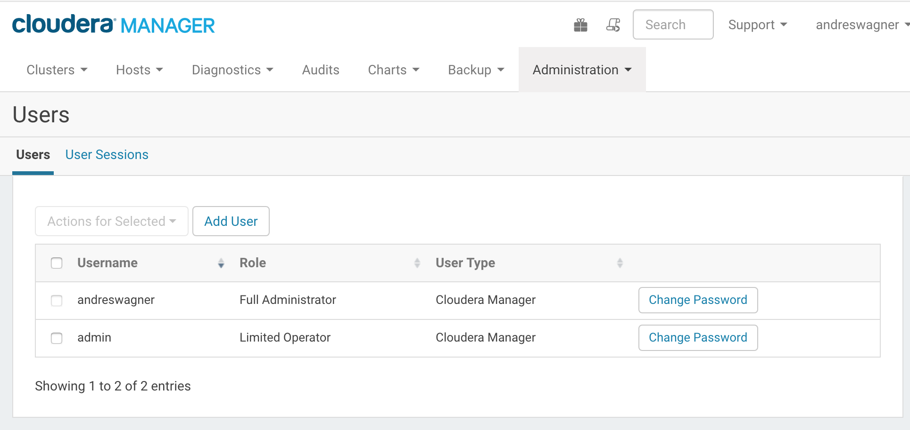

# Add a CM user and name it with your GitHub handle
Assign the Full Administrator role to this user
Assign the password cloudera to this user
Re-assign the admin user to the Limited Operator role
Take a screenshot of your users page; save it to storage/labs/4_CM_users.png
In an Issue comment, post the URL to your Cloudera Manager instance

